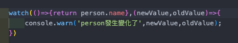
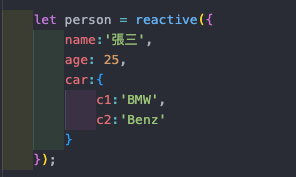
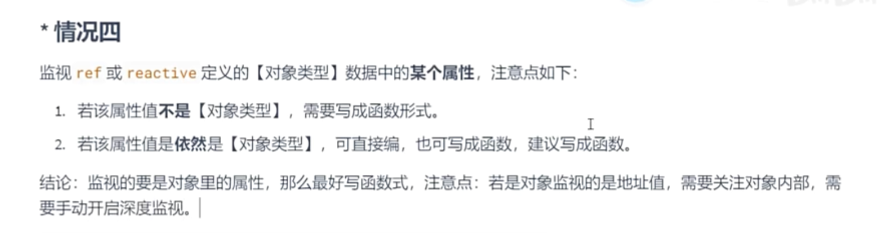

### 20241029 DevLog:

1. `set`與`get`方法

- 重點摘要
> 箭頭函數語法不支援 get 和 set 方法的定義。
> 函數的箭頭函數語法僅適用於簡單的只讀計算屬性

- 錯誤版本

```javascript
    let fullName2 = computed(()=>{
        get(){
            return firstName.value + '-' + lastName.value;
        },
        set(){
            console.log('setter')
        }
    })
```

- 正確版本

```javascript
    let fullName = computed({
        get() {
            return firstName.value + '-' + lastName.value;
        },
        set(value) {
            const names = value.split('-');
            firstName.value = names[0] || '';
            lastName.value = names[1] || '';
            console.log('setter');
        }
    });
```

- changeName()方法

```javascript
    function changeName(){
        fullName.value= 'Li-Si';
    }
```

詳細過程：
1. 觸發set：
    - 當執行`changeName()`時，`fullName.value`被改變，因此`set`當中的`value`就是`Li-Si`
2. 執行 set 的邏輯：
    - set 方法接收傳入的 value，並將其拆分為 firstName 和 lastName 的值（在這裡分別是 'Li' 和 'Si'），然後更新這兩個變數。
    - set 執行完成後，firstName 和 lastName 的值已更新。
3. get 方法的自動執行：
    - 當 firstName 和 lastName 變更後，Vue 的響應式系統會自動偵測到這些依賴已變化，因此會再次執行 get 方法來獲取最新的 fullName 值。
    - get 方法會合併新的 firstName 和 lastName 值，並將最新結果返回給 fullName。
  
-------

2. watch

 - 作用：監視數據變化
 - 特點：
    > `ref` 定義的數據
    > `reactive`定義的數據
    > 函數返回一個值
    > 一個包含上述內容的數組

watch 有一個返回值，可以用來停止監視行為
```javascript

    const stopWatch = watch(sum,(newVal,oldValue)=>{
        console.warn('sum發生變化了',newVal,oldValue);
        if(newVal >= 9){
            stopWatch();
        }
    })
```
> 情況二，監視[ref]定義的[對象類型]數據
> 在這個狀況下，
> 如果修改的是`ref`定義的對象中的屬性，則`newValue`跟`oldValue`是一樣的
> 如果修改的`ref`定義的對象，`newValue`為新值，`oldValue`為舊值，因為兩者不再是同一對象







*** 直接用 情況四：監視響應式對象中的某個屬性，且該屬性是[基本類型]，需要寫成函數式
-------

### 20241030 DevLog:

- 建立 `router` 分支

---

### 20241031 DevLog:

 - 新增 `record/devlog` 為獨立分支

